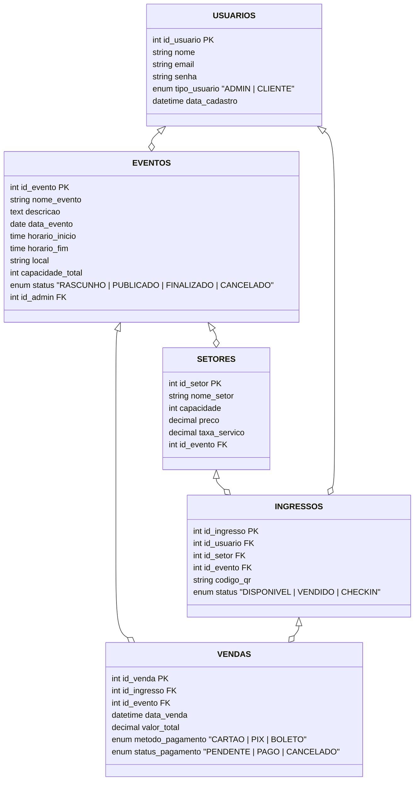

# api-casadeshow
Trabalho final da turma FS44 - Digital College


 # 🚀 API Node.js - Estrutura de Pastas

Este projeto segue uma arquitetura em **camadas** para manter o código organizado, escalável e de fácil manutenção.

---

## 📂 Estrutura de Pastas

```bash
src/
  config/                # Configurações da aplicação
    database.ts          # Conexão e setup do banco de dados
    env.ts               # Variáveis de ambiente centralizadas

  routes/                # Definição das rotas (endpoints)
    user.routes.ts
    auth.routes.ts

  controllers/           # Controladores: recebem requisições das rotas
    user.controller.ts
    auth.controller.ts

  services/              # Regras de negócio
    user.service.ts
    auth.service.ts

  repositories/          # Acesso ao banco de dados
    user.repository.ts

  middleware/            # Middlewares globais ou específicos
    auth.middleware.ts   # Verificação de autenticação
    error.middleware.ts  # Tratamento de erros

  validators/            # Validação de dados de entrada
    user.validator.ts    # Ex.: validação de criação/edição de usuário

  utils/                 # Funções utilitárias/auxiliares
    logger.ts            # Log centralizado
    hashPassword.ts      # Função para hash de senhas

  app.ts                 # Configuração principal do Express
  server.ts              # Ponto de entrada da aplicação

```
## Banco de dados

