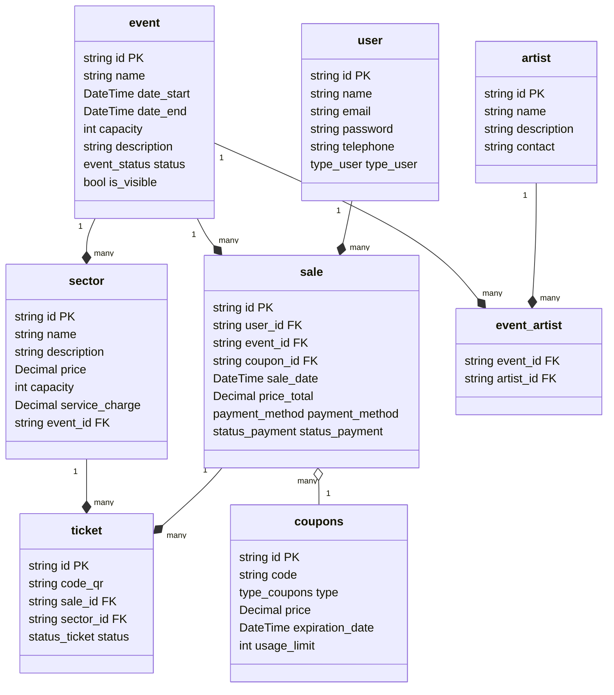

# api-casadeshow
Trabalho final da turma FS44 - Digital College.
Sistema de gerenciamento de eventos, artistas e vendas de ingressos.

---

## 🚀 Pré-requisitos

Antes de começar, você precisará ter as seguintes ferramentas instaladas em sua máquina:
* [Node.js](https://nodejs.org/en/)
* [Docker](https://www.docker.com/) e [Docker Compose](https://docs.docker.com/compose/)
* [Git](https://git-scm.com/)

---

## 🛠️ Configuração do Ambiente

Siga os passos abaixo para configurar e executar o projeto localmente.

1.  **Clone o repositório:**
    ```bash
    git clone [https://github.com/seu-usuario/api-casadeshow.git](https://github.com/seu-usuario/api-casadeshow.git)
    cd api-casadeshow
    ```

2.  **Configure as variáveis de ambiente:**
    Crie o arquivo `.env` a partir do exemplo.
    ```bash
    cp .env.example .env
    ```

3.  **Ajuste o arquivo `.env`:**
    Abra o arquivo `.env` e preencha com suas credenciais e chaves.
    ```properties
    # Banco de Dados
    MYSQL_ROOT_PASSWORD=sua_senha_forte
    MYSQL_DATABASE=casadeshow_db
    DATABASE_URL="mysql://root:sua_senha_forte@db:3306/casadeshow_db"

    # Autenticação
    SECRET_KEY_JWT=sua_chave_secreta

    # Redis
    REDIS_HOST=redis
    REDIS_PORT=6379
    ```

4.  **Inicie os containers:**
    Com o Docker em execução, suba os serviços (API, Banco de Dados, Redis).
    ```bash
    docker-compose up -d
    ```

A aplicação estará disponível em `http://localhost:8080` (ou a porta que você configurou).

---

## 📝 Endpoints Principais

### Autenticação
* `POST /api/auths/login` - Realizar login
* `PATCH /api/auths/change-password` - Alterar senha

### Usuários
* `POST /api/users` - Criar usuário
* `GET /api/users` - Listar usuários

### Eventos
* `GET /api/events` - Listar eventos
* `GET /api/events/:id` - Buscar evento por ID
* `POST /api/events` - Criar evento
* `PATCH /api/events/:id` - Atualizar evento
* `DELETE /api/events/:id` - Remover evento

### Artistas
* `GET /api/artists` - Listar artistas
* `POST /api/artists` - Criar artista
* `PATCH /api/artists/:id` - Atualizar artista

### Vendas
* `POST /api/sales` - Realizar venda

---

## 📚 Documentação e Monitoramento

* **Swagger UI:** `http://localhost:8080/api-docs`
* **Queue Dashboard (BullMQ):** `http://localhost:8080/admin/queues`
    * **Usuário:** `admin`
    * **Senha:** `senha123`

---

## 📂 Estrutura de Pastas

A estrutura do projeto segue uma arquitetura em camadas para separação de responsabilidades.

```bash
src/
  config/              # Configurações da aplicação
    database.ts        # Conexão e setup do banco de dados
    env.ts             # Variáveis de ambiente centralizadas

  routes/              # Definição das rotas (endpoints)
    user.routes.ts
    auth.routes.ts
    # ...outras rotas

  controllers/         # Controladores: recebem requisições das rotas
    user.controller.ts
    auth.controller.ts

  services/            # Regras de negócio
    user.service.ts
    auth.service.ts

  repositories/        # Acesso ao banco de dados (Prisma)
    user.repository.ts

  middleware/          # Middlewares globais ou específicos
    auth.middleware.ts   # Verificação de autenticação
    error.middleware.ts  # Tratamento de erros

  validators/          # Validação de dados de entrada (Zod, Joi, etc.)
    user.validator.ts    # Ex.: validação de criação/edição de usuário
    
  jobs/                # Processamento em background (Filas com BullMQ)

  lib/                 # Bibliotecas (Queue, Email, etc.)

  utils/               # Funções utilitárias/auxiliares
    logger.ts          # Log centralizado
    hashPassword.ts    # Função para hash de senhas

  app.ts               # Configuração principal do Express (Middlewares, Rotas)
  server.ts            # Ponto de entrada da aplicação (Inicializa o servidor)
```

# 🔄 Diagrama do Banco de Dados


## 🧪 Testes

Para garantir a qualidade e o funcionamento da API, execute os testes:

```bash
# Executar todos os testes
npm test

# Executar testes unitários
npm test test/unit

# Executar testes de integração
npm test test/integration

```

## 🛠️ Tecnologias

* Node.js + Express
* MySQL
* Redis
* Docker
* Prisma ORM
* BullMQ
* Jest
* Swagger


## 👥 Contribuidores

* Levy Sousa
* Iasmin Oliveira

## 🤝 Suporte

Para dúvidas ou problemas, abra uma issue no repositório.